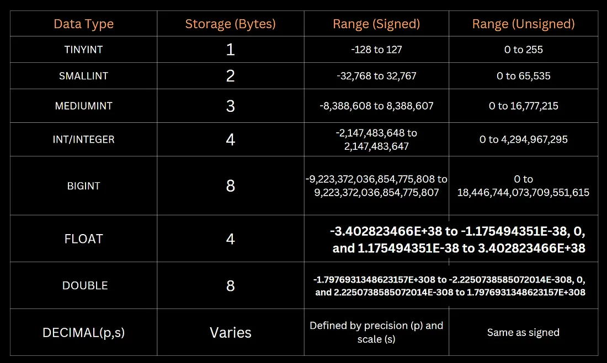

# What is a Database?

A database is an organized collection of structured information, or data, typically stored electronically in a computer system. Databases allow for data to be easily accessed, managed, modified, updated, and deleted. They serve as the backbone of various applications—everything from social media platforms to e-commerce websites and financial systems rely on databases to store user profiles, products, transactions, and more.

## Key Characteristics of Databases
- **Persistent Storage**: Data is stored over the long term, surviving application restarts and system reboots.  
- **Structured and Organized**: Data is systematically arranged to avoid duplication and inconsistency.  
- **Easily Retrievable**: Efficient methods exist for querying, filtering, and retrieving stored data quickly.  
- **Concurrent Access**: Multiple users and applications can use the database simultaneously without corrupting data.  
- **Security and Integrity**: Access can be controlled and data can be protected against unauthorized use or corruption.  

## Why Use a Database?
- To maintain a permanent record of information.  
- To ensure data integrity and reduce redundancy.  
- To efficiently handle large volumes of data and ensure fast retrieval.  
- To allow multiple users and applications to access and work with the data safely and concurrently.  
- To back up and recover data in case of hardware failures or data corruption.  

## Database Management Systems (DBMS)
It is software that manages databases, handling data storage, retrieval, updates, and security. It acts as an interface between databases and users/applications  

**Examples of DBMS:**  
- **Relational DBMS (RDBMS):** MySQL, PostgreSQL, Oracle, SQL Server  
- **NoSQL DBMS:** MongoDB, Cassandra, DynamoDB  
- **In-memory DBMS:** Redis, Memcached  

In this course we will focus on **MySQL** which is a popular open-source RDBMS  

---

## Introduction to the Relational Data Model
The relational data model organizes data into one or more tables (also known as relations) with rows and columns. The idea, introduced by **E.F. Codd in 1970**, revolutionized how databases are structured and queried.

### Key Concepts in the Relational Model
- **Tables (Relations):** A table represents an entity or a concept. For example, Employees, Customers, Products. Each table consists of rows and columns.  
- **Columns (Attributes):** Columns define the type of data stored. For example, in an Employees table, you might have columns like employee_id, first_name, last_name, hire_date. All rows in the same column share the same type and meaning of data.  
- **Rows (Records):** Each row in a table represents a single instance or record. For example, one row in the Employees table would represent one specific employee.  
- **Keys:** Primary Key & Foreign Key  
- **Relationships Between Tables:** 1:1, 1:M & M:N  

### Primary Key
A column or set of columns that uniquely identify each row in a table. For instance, employee_id can be a primary key if it uniquely identifies every employee.  

### Foreign Key
A column in one table that refers to the primary key in another table. For example, a department_id in the Employees table that references the department_id in a Departments table.  

---

### One-to-One (1:1)
Each row in Table A is related to exactly one row in Table B. For example, one employee might have one unique company car assigned.  

### One-to-Many (1:N)
One row in Table A can be associated with multiple rows in Table B. For example, one department can have many employees.  

### Many-to-Many (M:N)
Multiple rows in Table A can be associated with multiple rows in Table B. For example, employees can work on multiple projects, and projects can have multiple employees.  

---

## Why the Relational Model?
- **Data Integrity:** By using primary and foreign keys, the relational model enforces referential integrity. This means no orphaned records should exist (e.g., an employee record that refers to a department that doesn’t exist).  
- **Reduced Redundancy:** Through a process called normalization, relational databases are designed to minimize duplication and maintain consistent data.  
- **Flexibility in Querying:** Structured Query Language (SQL) provides a powerful, declarative way to retrieve and manipulate data in complex ways without changing the database design.  

---

## Numeric Data Type
Below is the table of **numeric data types in MySQL** along with their storage sizes and ranges:  

  

In case of DECIMAL, range of p is [1, 65] & that of s is [0, 30].  

---


# 📘 Database Terminologies (Complete Guide)

---

## 1️⃣ **Database**

A **database** is an organized collection of structured data stored electronically.

* Example: A university database may contain tables for **students, courses, exams, and results**.

---

## 2️⃣ **DBMS (Database Management System)**

Software that helps you **create, store, retrieve, update, and manage data** in a database.

* Examples: **MySQL, PostgreSQL, Oracle, SQL Server, MongoDB**.
* Types:

  * **RDBMS (Relational DBMS)** → Uses tables (MySQL, Oracle)
  * **NoSQL DBMS** → Uses documents/graphs/columns (MongoDB, Cassandra)

---

## 3️⃣ **Schema**

The **blueprint/structure** of a database.

* Defines how tables are organized, what columns exist, and relationships between them.
* Example: In a *Student Schema*, you may have:

  * Table: `Students` → (id, name, age, course\_id)
  * Table: `Courses` → (course\_id, course\_name, credits)

---

## 4️⃣ **Table (Relation)**

A table stores data in **rows and columns**.

* Example:

  | id | name   | age |
  | -- | ------ | --- |
  | 1  | Ramesh | 20  |
  | 2  | Anita  | 21  |

---

## 5️⃣ **Row (Tuple / Record)**

A **single entry** in a table.

* Example: `(1, 'Ramesh', 20)`

---

## 6️⃣ **Column (Attribute / Field)**

A **named data type** inside a table.

* Example: `id INT`, `name VARCHAR(50)`

---

## 7️⃣ **Primary Key**

* A **unique identifier** for each row in a table.
* Cannot be NULL.
* Example: `student_id` in `Students` table.

```sql
CREATE TABLE Students (
    student_id INT PRIMARY KEY,
    name VARCHAR(50),
    age INT
);
```

---

## 8️⃣ **Foreign Key**

* A column that refers to the **primary key of another table**.
* Used to maintain **relationships**.

```sql
CREATE TABLE Enrollments (
    enroll_id INT PRIMARY KEY,
    student_id INT,
    course_id INT,
    FOREIGN KEY (student_id) REFERENCES Students(student_id)
);
```

---

## 9️⃣ **Candidate Key**

* All possible columns that can uniquely identify rows.
* Example: In a `Students` table, both `student_id` and `email` could be candidate keys.

---

## 🔟 **Composite Key**

* A **combination of two or more columns** used as a key.
* Example: `student_id + course_id` in an `Enrollments` table.

---

## 1️⃣1️⃣ **Alternate Key**

* Candidate keys that are **not chosen as primary key**.
* Example: If `student_id` is primary key, then `email` becomes an alternate key.

---

## 1️⃣2️⃣ **Super Key**

* Any column (or set of columns) that **uniquely identifies a row**.
* Example: `{student_id}`, `{email}`, `{student_id, name}`.

---

## 1️⃣3️⃣ **Constraints**

Rules applied to columns/tables to ensure **data integrity**.

* **NOT NULL** → column cannot be empty
* **UNIQUE** → values must be unique
* **CHECK** → condition must be satisfied
* **DEFAULT** → assigns a default value
* **PRIMARY KEY, FOREIGN KEY** → uniqueness & relationships

---

## 1️⃣4️⃣ **Normalization**

* Process of **organizing data to reduce redundancy and improve consistency**.
* Normal Forms (NF):

  * 1NF → atomic values only
  * 2NF → no partial dependency
  * 3NF → no transitive dependency

---

## 1️⃣5️⃣ **Denormalization**

* Opposite of normalization.
* Adds redundancy for **faster queries**.
* Often used in **data warehouses**.

---

## 1️⃣6️⃣ **Index**

* A **data structure** that improves query performance.
* Works like the **index of a book**.

```sql
CREATE INDEX idx_name ON Students(name);
```

---

## 1️⃣7️⃣ **View**

* A **virtual table** created using a query.
* Doesn’t store data itself, only stores the query logic.

```sql
CREATE VIEW HighSalary AS
SELECT name, salary FROM Employees WHERE salary > 50000;
```

---

## 1️⃣8️⃣ **Stored Procedure**

* A **set of SQL statements** stored in the database and executed together.

```sql
CREATE PROCEDURE GetEmployees()
BEGIN
   SELECT * FROM Employees;
END;
```

---

## 1️⃣9️⃣ **Trigger**

* A **set of SQL actions that run automatically** when an event occurs (INSERT, UPDATE, DELETE).

```sql
CREATE TRIGGER before_insert_student
BEFORE INSERT ON Students
FOR EACH ROW
SET NEW.created_at = NOW();
```

---

## 2️⃣0️⃣ **Transaction**

* A **unit of work** that groups multiple SQL statements.
* Properties: **ACID**

  * **Atomicity** → all or nothing
  * **Consistency** → maintains valid state
  * **Isolation** → no interference between transactions
  * **Durability** → changes survive crashes

---

## 2️⃣1️⃣ **Joins**

* Used to combine data from multiple tables.
* Types:

  * **INNER JOIN** → only matching rows
  * **LEFT JOIN** → all from left + matching right
  * **RIGHT JOIN** → all from right + matching left
  * **FULL JOIN** → all rows from both

---

## 2️⃣2️⃣ **Data Dictionary**

* Metadata repository (stores info about tables, schemas, users, constraints).

---

## 2️⃣3️⃣ **Deadlock**

* When two transactions wait for each other’s resources → both stuck.

---

## 2️⃣4️⃣ **Concurrency**

* Multiple users accessing the database at the same time without conflicts.

---

## 2️⃣5️⃣ **Replication**

* Copying database data across multiple servers for **backup, performance, and availability**.

---

# 🔑 Quick Recap (Mind Map)

* **Database** → container for data
* **DBMS** → software to manage database
* **Schema** → design/blueprint
* **Tables** → hold rows + columns
* **Keys** → maintain uniqueness & relationships
* **Constraints** → rules for data integrity
* **Normalization** → reduce redundancy
* **Indexes & Views** → improve performance & readability
* **Stored Procedures & Triggers** → automate SQL
* **Transactions (ACID)** → ensure reliability
* **Joins** → combine multiple tables

---
